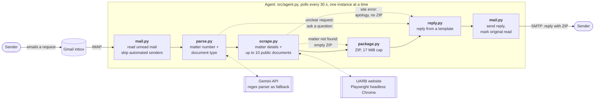

# UARB Regulatory Document Agent

An email agent that fetches regulatory filings for you. Email it a matter number and a document type, and it
replies with a ZIP of up to 10 of those documents plus a summary of the matter.

Documents come from the Nova Scotia Utility and Review Board's public database
(<https://uarb.novascotia.ca/fmi/webd/UARB15>). This is the data-collection stage of a larger regulatory
research agent.

> **You email:** "Hi Agent, Can you give me Other Documents files from M12205? Thanks!"
>
> **It replies:** "M12205 is about Halifax Regional Water Commission - Windsor Street Exchange Redevelopment
> Project - $69,275,000. It relates to Capital Expenditure Approvals within the Water category. The matter had
> an initial filing on April 7, 2025 and a final filing on October 23, 2025. I found 13 Exhibits, 6 Key
> Documents, 43 Other Documents, and no Transcripts or Recordings. I downloaded 10 out of the 43 Other Documents
> and am attaching them as a ZIP here."
>
> ...with `M12205_Other_Documents.zip` attached.

Document types: **Exhibits, Key Documents, Other Documents, Transcripts, Recordings**.
Matter numbers look like `M12205` (the letter M and 5 digits).

## How it works



| Step | Module | What it does |
|---|---|---|
| Inbox | [src/mail.py](src/mail.py) | Polls Gmail over IMAP for unread mail; sends replies over SMTP. |
| Parse | [src/parse.py](src/parse.py) | Gemini extracts `(matter, document type)` from free-form email. Its answer is validated in code: the matter number must literally appear in the email and the type must be one of the five. If there's no API key, or the call fails or is rejected, a regex parser takes over. Unclear or multi-part requests get a clarification question, not a guess. |
| Scrape | [src/scrape.py](src/scrape.py) | Drives the site with Playwright: enters the matter number, reads the metadata and per-tab counts, opens the tab, and downloads the first 10 documents with **GO GET IT**. |
| ZIP | [src/package.py](src/package.py) | Zips the files, capped at 17 MiB so the email stays under Gmail's 25 MB limit. |
| Reply | [src/reply.py](src/reply.py) | Fills a fixed template from the scraped data. There's no LLM in this step, so every number in the email comes straight from the site. |
| Loop | [src/agent.py](src/agent.py) | Ties it together and handles the failure paths below. |

The site is a JavaScript-rendered FileMaker WebDirect app with no static pages or stable URLs, which is why a real
browser is needed.

## Setup

**Requirements:** Python 3.10+ (developed on 3.13) and a Gmail account dedicated to the agent.

```bash
git clone <this repo> && cd sp-scraper
python3 -m venv .venv && source .venv/bin/activate
pip install -r requirements.txt
playwright install chromium
cp .env.example .env        # then fill it in, see below
```

### 1. Gmail app password
The agent signs in over IMAP/SMTP, which Google only allows with an **app password**. Your normal Gmail password
will not work.

1. Sign in to the agent's Gmail account and turn on **2-Step Verification** (Google Account → Security).
2. Go to <https://myaccount.google.com/apppasswords> and create a password named e.g. "uarb-agent".
3. Google shows 16 letters in four groups. Copy all of them into `.env` as `GMAIL_APP_PASSWORD`. Spaces are fine.
4. Put the account's address in `GMAIL_ADDRESS`. If Gmail's settings still show an IMAP on/off toggle, make sure it's on.

### 2. Gemini API key (optional but recommended)
Create a key at <https://aistudio.google.com/apikey> and set `GEMINI_API_KEY` in `.env`. Without it the agent still
works, using the regex parser, which handles plain phrasing like "Other Documents from M12205" but not
free-form wording like "the evidence filed on M12205". The model defaults to `gemini-3.6-flash`; override with
`GEMINI_MODEL`.

### `.env` reference
| Variable | Required | Notes |
|---|---|---|
| `GMAIL_ADDRESS` | yes | The agent's Gmail address. |
| `GMAIL_APP_PASSWORD` | yes | 16-letter app password, not the account password. |
| `GEMINI_API_KEY` | no | Enables LLM parsing. |
| `GEMINI_MODEL` | no | Default `gemini-3.6-flash`. |

`.env` is gitignored. Never commit real credentials.

## Running

```bash
python main.py                 # watch the inbox continuously (checks every 30 s)
python main.py --once          # process whatever is waiting, then exit
python main.py --interval 10   # check more often
```

Now email the agent's address from any account. A reply with the ZIP arrives in about a minute.

**It is a polling loop, not a webhook.** Nothing runs when an email arrives; the process checks the inbox every
30 seconds. It must be running (and the machine awake and online) to answer. Emails that arrive while it's stopped
stay unread and are answered when it next starts. For an always-on setup, run it on a small server or schedule
`python main.py --once` with cron/launchd.

**Run only one agent at a time.** Two agents polling the same inbox both pick up the same unread email and each
sends a reply, and if one is running old code you can get a wrong answer and a right one. The agent enforces
this: starting a second copy exits with the PID of the one already running. Stop the old one (Ctrl+C) before
starting it again after a code change.

Replies are sent to whoever emailed the agent. There is no sender allowlist.

### Trying pieces on their own
```bash
python -m src.scrape M12205 "Other Documents"        # scrape + download to ./downloads/M12205
python -m src.scrape M12205 Transcripts --headed     # watch the browser
python -m src.parse "Can I get the key docs for M12205?"        # see how an email is parsed
python -m src.parse --regex-only "exhibits for M12205"          # regex parser only
python main.py --once --allow-self                   # answer mail sent from the agent's own address (self-test)
```

## What happens in each situation

| Situation | Reply |
|---|---|
| Normal request | Summary and a ZIP of the first 10 documents (or all of them if fewer than 10). |
| Matter doesn't exist | A clear "couldn't find matter M…" message with an **empty ZIP**. |
| Tab has no documents | Says so, with an empty ZIP. |
| Documents marked **Confidential** | Skipped and listed in the reply. On the site their GO GET IT button only serves a one-page "Confidentiality Notice", not the filing, so they would waste slots in the 10-file limit. The agent keeps going down the list until it has 10 public documents. |
| No matter number, no type, several types or several matters | A polite clarification question. |
| Some documents can't be downloaded or are too large | The rest are sent, with a list of what was left out and why. |
| ZIP would exceed 17 MiB | Files are added in order until the cap; the summary names any skipped. |
| Site down or scraper error | A short apology, no attachment. The failure is logged. |

"First 10" means the first 10 public documents in the order the site lists them, which differs by tab (newest first for Other Documents, oldest first for Key Documents, exhibit-number order for Exhibits).

Not answered, to avoid mail loops: `no-reply` / `mailer-daemon` senders, `Auto-Submitted`, bulk and mailing-list
mail, and the agent's own address. An email that fails repeatedly is retried three times, then marked read.

## Tests

```bash
python -m pytest        # 82 tests, all offline (no site, Gmail or Gemini needed)
```

The tests cover parsing of real page text captured from the site, the ZIP size cap, reply wording, email
handling and loop protection, and the agent loop using fakes. The live pieces are checked by hand with the commands above.

## Known limitations

- **Tabs verified live:** Other Documents, Exhibits and Key Documents (all downloaded and opened as valid PDFs).
  **Transcripts and Recordings are untested with real data**: the two matters I looked at (M12205, M12383) have
  none, so only the empty case is confirmed. Recordings may be large media files, which the size cap will skip.
- **Hearings and Related Matters tabs are out of scope.** The agent handles the five document tabs only; a request
  for either gets a reply asking for one of the five document types.
- **Big files don't fit in an email.** Some exhibits are 25-50 MB each (M12205's first exhibit is 47 MB), so an Exhibits
  request can end up with only a few small files in the ZIP; the reply lists what was left out and why.
- **Fragile by nature.** The scraper depends on the UARB site's current layout. If they change the page, the scraper
  will need updating. The matter box also drops keystrokes typed too soon after focusing, so the scraper waits
  and retries.
- **One request at a time**, with a single browser session, which is gentler on the site.
- **The "final filing" date** is the site's "Date Final Submissions" field, and "initial filing" is "Date Received".
- **Open access.** Anyone who emails the agent gets a reply. Add a sender allowlist in
  [src/agent.py](src/agent.py) before exposing it publicly.

## Project layout

```
main.py             entry point
src/
  agent.py          inbox loop and per-email handling
  mail.py           IMAP polling, SMTP sending, loop protection
  parse.py          email -> (matter, document type): Gemini + regex fallback
  scrape.py         Playwright scraper for the UARB site
  package.py        ZIP builder with the size cap
  reply.py          reply email templates
tests/              offline unit tests
requirements.txt    pinned dependencies
.env.example        configuration template
```
